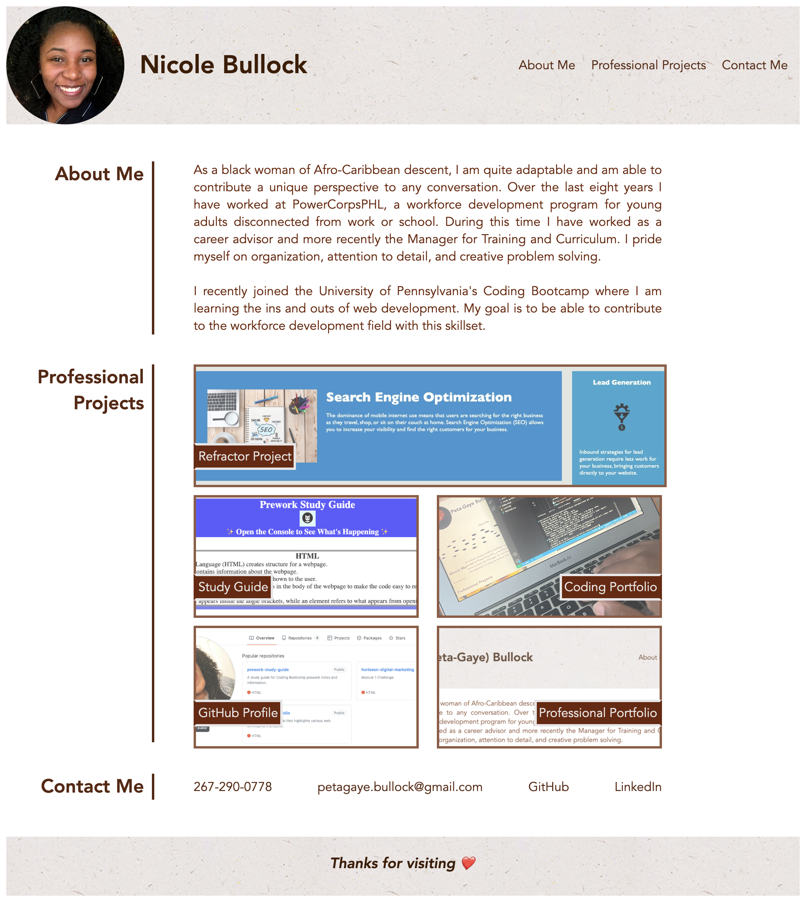

# Professional Portfolio

## Description

This webpage is designed as a space for hiriing managers to learn more about me, view samples of my professional coding projects, get access to my GitHub and LinkedIn profiles, and contact me if needed. 

## Installation

N/A

## Usage

This webpage is designed with navigation links at the top, that when clicked, take you to the about me, professional projects,or contact me sections of the page. If you click on any of the images in the professional projects section of the webpage then you are taken to that deployed application. When you hover your mouse on the navigation links they are underlined. When you hover your mouse over the project images they become brighter. When you hover your mouse over the contact info links they become bold and italicized. 

## Credits

[Header and Footer Background Image](https://www.toptal.com/designers/subtlepatterns/uploads/ep_naturalwhite.png)

## License

Please refer to the license in the repo.

## Deployed Application w/ Screenshot
[Deployed Application](https://pbullock08.github.io/professional-portfolio/)
